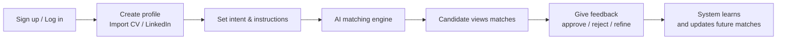

## The Matching Process

1. **Complete Your Profile:** Upload your CV or connect LinkedIn.
2. **Set Instructions:** Tell the AI what you want (role, salary, culture, deal-breakers).
3. **Receive Matches:** The system continuously finds opportunities that fit your criteria.
4. **Review & Connect:** Evaluate matches. If you like a role and the employer likes you, you connect.

## Candidate journey



## Writing Great Instructions

Your AI instructions are the most powerful tool you have. You can edit them at any time to refine your matches.

<Steps>
  <Step title="Be Specific">
    Clearly state what you're looking for
  </Step>
  <Step title="Include Priorities">
    List your must-haves and nice-to-haves
  </Step>
  <Step title="Add Context">
    Provide relevant background information
  </Step>
  <Step title="Review and Refine">
    Review matches and provide feedback.
  </Step>
</Steps>

**When to update:**

- You aren't getting relevant matches.
- Your preferences or situation changes.
- You want to explore a different type of role.

**How to write good instructions:**

- **Be Specific:** "Remote only, min \$150k, fintech" is better than "Good job".
- **List Deal-Breakers:** "No gambling companies", "No require relocation".
- **Add Context:** "I want to move from IC to Manager".

## Examples

### Good Example

```
Looking for a senior frontend role with React and TypeScript.
Prefer remote work with flexible hours. Interested in fintech or healthtech.
```

### Better Example

```
Seeking senior frontend engineering position (5+ years experience).
Must-haves: React, TypeScript, remote work.
Preferences: Fintech/healthtech, flexible hours, growth opportunities.
Avoiding: Agencies, strict 9-5, heavy travel.
```

<Tip>
  More detailed instructions lead to better match
</Tip>

## Profile Privacy

NoSocial is private by default.

- **Private Instructions:** Your instructions are _never_ shown to employers. They are only used by the AI to find matches.
- **Data Safety:** Personal contact info is only shared when you mutually agree to connect.

## Troubleshooting: No New Matches?

If you aren't seeing matches, check these common reasons:

<AccordionGroup>
  <Accordion title="Instructions Too Narrow">
    **Problem:** Your criteria might be too specific (e.g., "Google only", "Exact salary \$205k"). **Solution:** Broaden your search or mark some criteria as "preferred" rather than "required".
  </Accordion>
  <Accordion title="Profile Incomplete">
    **Problem:** Missing key skills or experience details. **Solution:** Ensure your profile is complete so the AI understands your background.
  </Accordion>
  <Accordion title="Market Conditions">
    **Problem:** Fewer roles in your specific niche right now. **Solution:** Keep your profile active; the system matches continuously as new roles appear.
  </Accordion>
</AccordionGroup>