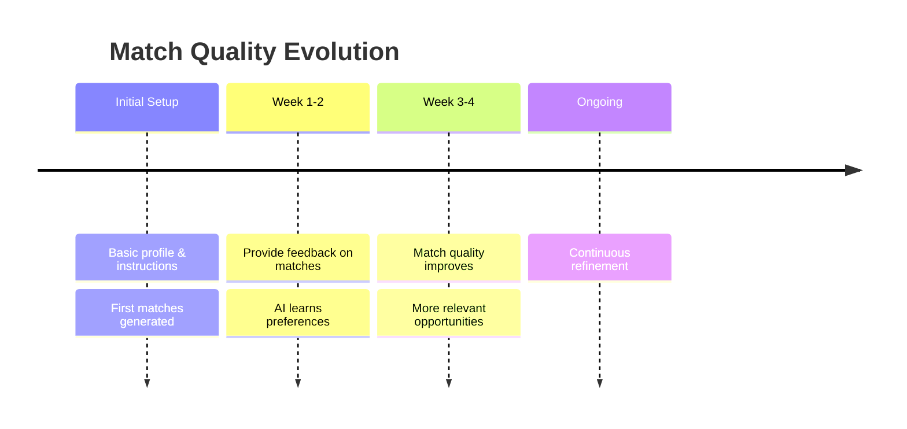

## Context & Intent

CVs and JDs capture history and wishlists. They rarely capture what either side is actually trying to achieve _right now_. NoSocial puts context and intent at the center of matching.

**For Candidates:**

- What you want next (e.g. “first PM role”, “move from agency to product company”)
- Constraints (visa, relocation, caregiving responsibilities)
- Workstyle and culture preferences

**For Employers:**

- Why this role exists (new product, replacement, scaling a team)
- Team maturity and expectations
- Strategic goals (e.g. “ship X in 6 months”)

Most of this information stays private to your AI agent. It is used to shape which matches you see and how they are prioritized.

## Two-Sided Evaluation

Most hiring tools are optimized for one side. NoSocial explicitly evaluates every potential match from both perspectives.

- **Candidate Score:** How well does this job fit your requirements and constraints?
- **Employer Score:** How well does this candidate fit the role and team needs?

Matches are only surfaced when there is a strong fit on _both_ sides, reducing noise and wasted time. This matching process is slower than a typical "show me jobs or candidates" approach that is a search query. NoSocial performs matching across the entire market and this takees longer. 

The advantage of this approach is that when you see a match, it is a 2-sided fit that has a 70X lower signal-to-noise ratio vs other platforms and orders of magnitute higher probabilyt for securing an interview. 

## Continuous Matching

Traditional platforms run a search only when you hit “apply” or “search”. NoSocial runs matching continuously in the background.

- **Always On:** As new roles or candidates enter the system, they are immediately evaluated against your criteria.
- **Dynamic:** When you update your preferences, your existing matches are re-evaluated.
- **Evolving:** Feedback you give on one match improves the next set of matches.

## Feedback Driven

NoSocial learns from the feedback you provide. For every match you reject or accept, the system refines its understanding of your preferences.

- **Refine Understanding:** Discover unstated preferences through patterns.
- **Identify Deal-Breakers:** Learn what you definitely don't want.
- **Provide Insights:** The AI may share insights like "You tend to prefer smaller companies" based on your behavior.

## Understanding Match Scores

<CardGroup cols={3}>
  <Card title="High Match" icon="star" color="#16a34a">
    90-100% compatibility. Strong fit on both sides.
  </Card>
  <Card title="Good Match" icon="check" color="#2563eb">
    70-89% compatibility. Meets most core requirements.
  </Card>
  <Card title="Potential Match" icon="circle-question" color="#ca8a04">
    50-69% compatibility. Worth reviewing but may have gaps.
  </Card>
</CardGroup>