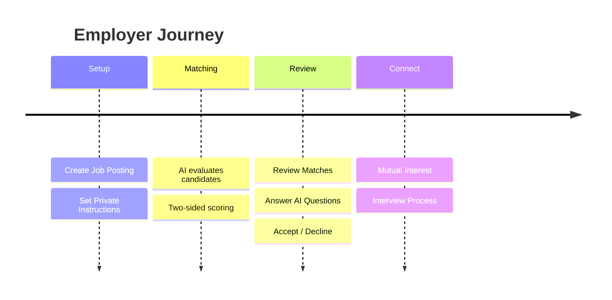

## The Matching Process

1. **Create a Job Posting:** Create a job posting from the Teams Section
2. **Set Instructions:** Provide your "real" instructions to the system
3. **Receive Matches:** The system continuously finds opportunities that fit your criteria.
4. **Review & Connect:** Evaluate matches. If you like a candidate, request an interview. 

## Creating a Job Posting

To get the best candidates, you need more than a standard Job Description.

1. **Job Details:** Title, description, responsibilities.
2. **Private Instructions:** Tell the AI what you _really_ need.
   - "Must have startup experience."
   - "Budget is strict \$120k."
   - "Need someone who can wear multiple hats."
3. **Publish:** The system immediately starts evaluating existing candidates against your criteria.

## Writing Effective Instructions

Your private instructions guide the AI to find the right fit beyond the public job description.

### Example: Product Manager Role

**Public Job Description:**

> "We are looking for a Product Manager to lead our mobile app team..."

**Private Instructions (The "Real" Need):**

> "We need someone who has specifically shipped a mobile app from 0 to 1.
>
> - **Must-have:** Experience with fintech or banking apps.
> - **Culture:** We are a chaotic startup, need someone who thrives in ambiguity, not a big-co person who needs structure.
> - **Deal-breaker:** Anyone who hasn't worked in a team \< 50 people.
> - **Budget:** Max \$160k base, but high equity."

<Tip>
  The more honest you are in your private instructions, the better your matches will be.
</Tip>

## AI Evaluations

NoSocial uses AI to evaluate every candidate against your specific role requirements.

- **Skill Matching:** Beyond keywords, understanding depth and context.
- **Cultural Fit:** Aligning work styles and preferences.
- **Two-Sided Score:** Ensuring the candidate is also interested in your type of role.

**Score Tiers:**

- **Excellent (90-100%):** Strong mutual fit.
- **Good (70-89%):** Solid option, meets core needs.
- **Potential (50-69%):** May have gaps but worth considering.

## Managing Matches

<CardGroup cols={2}>
  <Card title="Review" icon="eye">
    See detailed AI analysis of why a candidate is a match.
  </Card>
  <Card title="Accept/Decline" icon="check-double">
    **Accept:** Express interest. If they accept too, you connect. **Decline:** Remove from list. This teaches the AI what you don't want.
  </Card>
</CardGroup>

**Key Actions:**

- **Answer Questions:** In the review panel, the AI may ask clarifying questions (e.g., "Is this candidate's agency experience relevant?"). Answering these drastically improves future matches.
- **Rate Matches:** Always accept or decline. Leaving matches "pending" prevents the AI from learning.
- **Provide Feedback:** If you decline, tell the AI why (e.g., "Too junior", "Wrong industry").