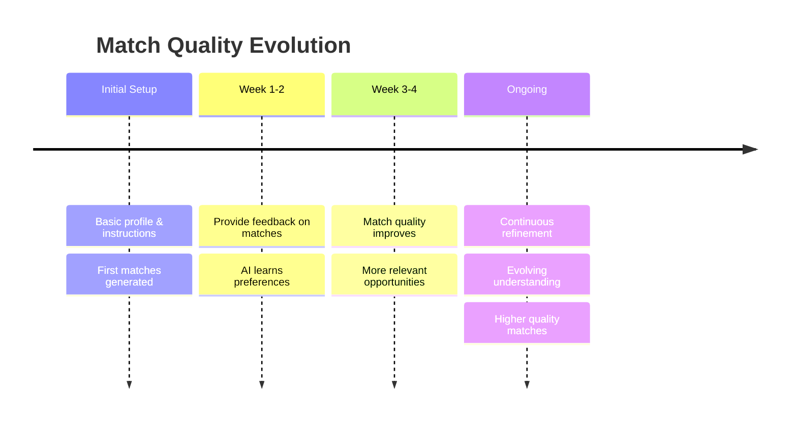

Traditional platforms run a search only when you hit “apply” or “search”. NoSocial runs matching continuously in the background.

What this means for candidates:

- You don’t have to re-apply to every new role. Once your profile and instructions are set, the system keeps looking for better fits as new roles and companies come in.
- When you update your preferences (e.g. salary, location, role seniority), your existing matches are re-evaluated against the new criteria.
- Feedback you give on one match improves the next set of matches without you having to rewrite your profile.

What this means for employers:

- New relevant candidates can surface for an open role without re-running manual searches or rewriting the JD.
- As you give feedback (shortlist, reject, hire), the system adjusts which candidates are shown next and in what order.
- Open roles effectively have a “live” funnel that refines over time, instead of a static batch of applications.

The result: match quality improves the longer you use the system, without extra manual work.\
\
The Matching Timeline

## Next: 

<CardGroup cols={2}>
  <Card title="Back: Feedback Driven" icon="arrow-left" href="/introduction/feedback-driven">
    Return to Feedback Driven
  </Card>
  <Card title="Next: Understanding Matches" icon="arrow-right" href="/introduction/understanding-matches">
    Deep dive into Match Quality
  </Card>
</CardGroup>