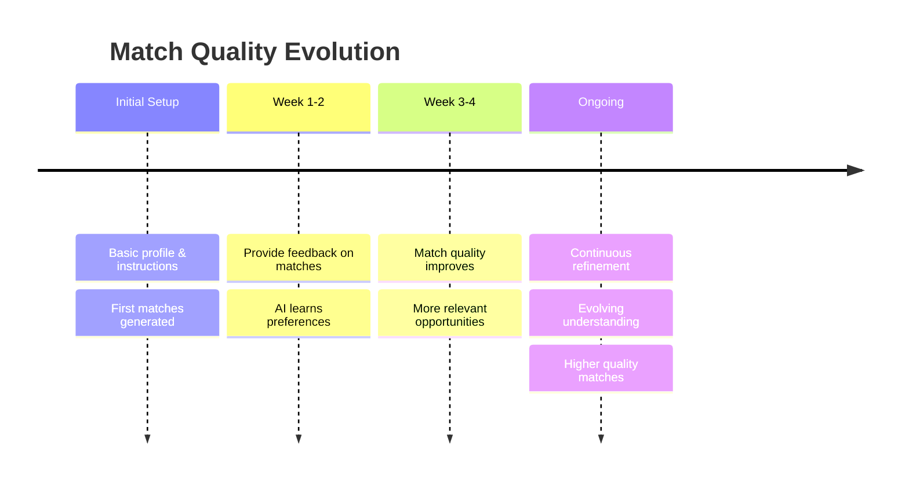

Traditional platforms run a search only when you hit “apply” or “search”. NoSocial runs matching continuously in the background.

- Once your instructions are set, the system keeps looking for better fits as new roles and companies come in.
- When you update your preferences (e.g. salary, location, role seniority), your existing matches are re-evaluated against the new criteria.

The result: match quality improves the longer you use the system, without extra manual work.  Every generation of matching improves upon the previous. \
\
The Matching Timeline

## Next:

<CardGroup cols={2}>
  <Card title="Back: Feedback Driven" icon="arrow-left" href="/introduction/feedback-driven">
    Return to Feedback Driven
  </Card>
  <Card title="Next: Understanding Matches" icon="arrow-right" href="/introduction/understanding-matches">
    Deep dive into Match Quality
  </Card>
</CardGroup>