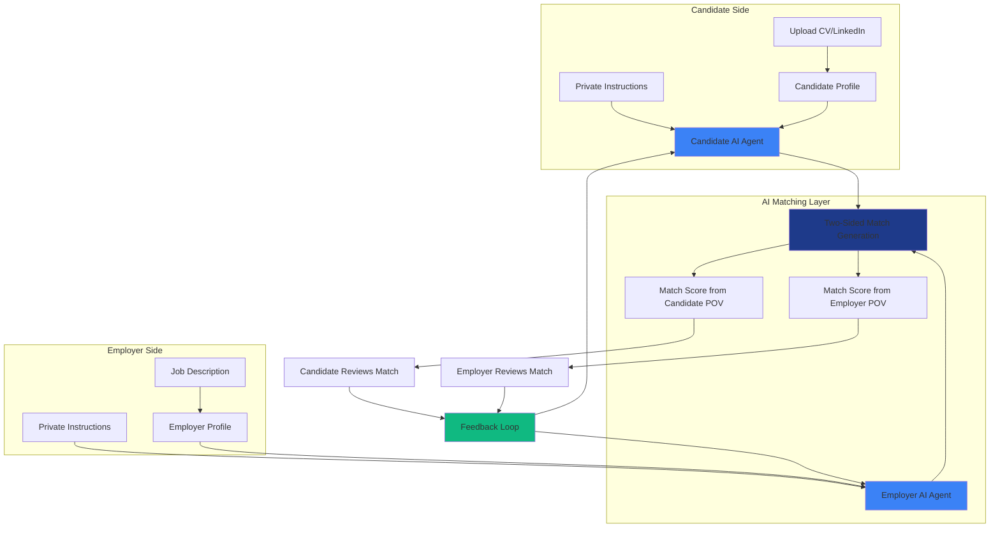
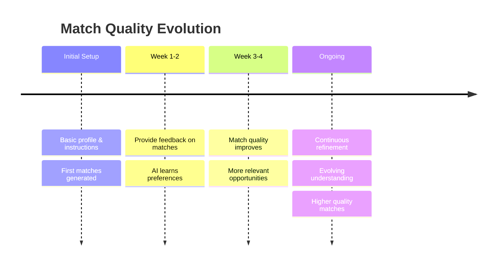
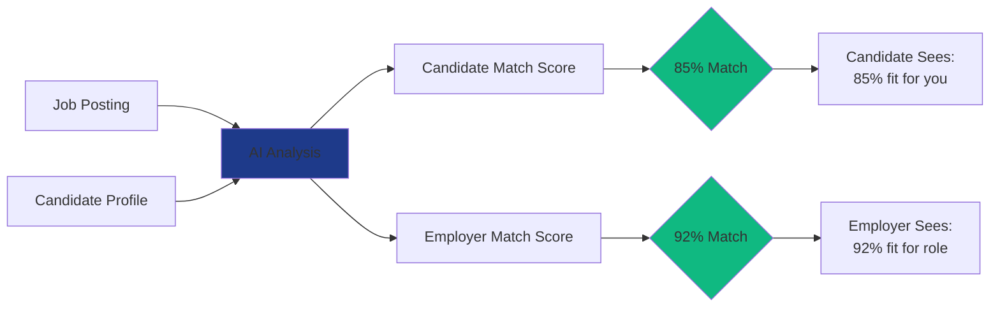

## Overview

NoSocial revolutionizes job matching by using AI agents that work on behalf of both candidates and employers, ensuring privacy while delivering high-quality matches. Unlike traditional platforms, your private information and deal-breakers remain confidential throughout the entire process.

## The NoSocial Method

<Frame caption="NoSocial's AI-Powered Matching Process">

</Frame>

## How It Works: Step by Step

<Steps>
  <Step title="Candidates Share Their Profile">
    Candidates provide their work history by uploading their CV or connecting their LinkedIn profile. This forms the foundation of their professional profile on NoSocial.
  </Step>
  
  <Step title="Candidates Set Private Instructions">
    Candidates provide detailed instructions about what they're looking for, including:
    - Role preferences and requirements
    - Deal-breakers (e.g., "no agencies", "must be remote")
    - Salary expectations
    - Work culture preferences
    - Other private information
    
    **Important:** This information is only available to your personal AI agent and is never shared with employers.
  </Step>
  
  <Step title="Employers Create Job Postings">
    Employers provide a job description along with their own private instructions, which may include:
    - Hidden requirements
    - Budget constraints
    - Team dynamicsNoSocial's mission is to deliver continuous opportunity—matching every professional and employer as intent and markets evolve
    - Strategic hiring goals
    
    **Important:** This private information remains confidential and is only used by the employer's AI agent.
  </Step>
  
  <Step title="AI Generates Two-Sided Matches">
    NoSocial's AI analyzes both sides independently and generates matches that are evaluated from two perspectives:
    - **Candidate POV:** How well does this job fit the candidate's requirements?
    - **Employer POV:** How well does this candidate fit the role?
    
    Each match receives two separate scores, ensuring both parties' interests are represented.
  </Step>
  
  <Step title="Feedback Refines Understanding">
    Both candidates and employers review their matches and provide feedback. The AI learns from this feedback to:
    - Improve future match quality
    - Better understand preferences
    - Provide actionable insights to users
    - Refine its matching algorithm
  </Step>
  
  <Step title="Continuous Improvement">
    As both candidates and employers interact with the platform, their understanding of what they want evolves. The AI adapts to these changes, resulting in progressively better matches over time.
  </Step>
  
  <Step title="Privacy Always Protected">
    Throughout the entire process, no private or personally identifiable information (PII) is shared between candidates and employers until both parties mutually agree to connect.
  </Step>
</Steps>

## Key Principles

<CardGroup cols={2}>
  <Card title="Privacy First" icon="shield-halved">
    Your private instructions and deal-breakers remain confidential. Only your AI agent knows them.
  </Card>
  
  <Card title="Two-Sided Evaluation" icon="scale-balanced">
    Every match is scored from both the candidate's and employer's perspective for fair representation.
  </Card>
  
  <Card title="AI-Powered Learning" icon="brain">
    The system continuously learns from your feedback to deliver better matches over time.
  </Card>
  
  <Card title="No PII Sharing" icon="user-secret">
    Personal information is never shared without mutual consent and agreement.
  </Card>
</CardGroup>

## The Matching Timeline

## How Feedback Improves Matches

<AccordionGroup>
  <Accordion title="What happens when you rate a match?">
    When you rate a match (positive or negative), the AI analyzes:
    - What aspects you liked or disliked
    - Patterns across your feedback
    - How to adjust future recommendations
    - What insights to share with you about your preferences
  </Accordion>
  
  <Accordion title="How does the AI learn from feedback?">
    The AI uses your feedback to:
    - Refine understanding of your stated preferences
    - Discover unstated preferences through patterns
    - Weight different criteria based on importance
    - Identify deal-breakers you may not have explicitly mentioned
  </Accordion>
  
  <Accordion title="What feedback does the AI provide to users?">
    Based on your interactions, the AI may provide insights like:
    - "You tend to prefer smaller companies over large corporations"
    - "Remote work appears to be more important than you indicated"
    - "You might want to expand your search to include [X] industry"
  </Accordion>
</AccordionGroup>

## Privacy Protection

<Warning>
  NoSocial takes privacy seriously. Here's what's NEVER shared without your explicit consent:
</Warning>

<Tabs>
  <Tab title="Candidate Privacy">
    **Protected Information:**
    - Current employer (if specified as private)
    - Salary expectations and requirements
    - Deal-breakers and red flags
    - Personal preferences and constraints
    - Contact information
    - Location (if set to private)
    
    **Shared Only After Mutual Interest:**
    - Full name
    - Direct contact details
    - Complete work history
  </Tab>
  
  <Tab title="Employer Privacy">
    **Protected Information:**
    - Budget and salary range details
    - Internal hiring requirements
    - Team composition concerns
    - Strategic hiring plans
    - Company challenges
    - Competitive information
    
    **Shared Only After Mutual Interest:**
    - Company name (if obfuscated)
    - Hiring manager details
    - Team structure
  </Tab>
</Tabs>

## The Two-Sided Match Explained

**Why Two Scores?**
- A candidate might be great for a job (employer's 92% match)
- But the job might not be perfect for the candidate (candidate's 85% match)
- Both perspectives matter for a successful hire

## What Makes NoSocial Different?

<CardGroup cols={3}>
  <Card title="No Social Media Required" icon="ban">
    No public profiles or networking pressure
  </Card>
  
  <Card title="AI Agents for Both Sides" icon="robot">
    Each party has their own AI advocate
  </Card>
  
  <Card title="Private by Default" icon="lock">
    Your secrets stay secret until you choose to share
  </Card>
  
  <Card title="Feedback-Driven" icon="comments">
    The system gets smarter with every interaction
  </Card>
  
  <Card title="Two-Sided Scoring" icon="arrow-right-arrow-left">
    Fair evaluation from both perspectives
  </Card>
  
  <Card title="Evolving Matches" icon="chart-line">
    Quality improves as you both learn what you want
  </Card>
</CardGroup>

## Next Steps

<Card title="Ready to Get Started?" icon="rocket" href="/getting-started/create-account">
  Create your account and experience privacy-first matching
</Card>

<CardGroup cols={2}>
  <Card title="For Candidates" icon="user" href="/for-candidates/candidate-matching">
    Learn how to set up your profile and instructions
  </Card>
  
  <Card title="For Employers" icon="building" href="/for-employers/create-posting">
    Learn how to create effective job postings
  </Card>
</CardGroup>
